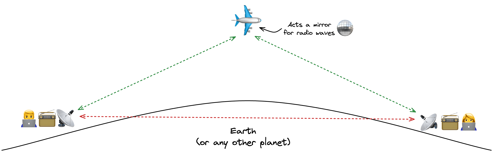

# Airplane Disco ✈️🪩

[Airplane Scatter](https://en.wikipedia.org/wiki/Airplane_scatter) prediction calculator



This project uses [Vue 3](https://vuejs.org/), [Typescript](https://www.typescriptlang.org/), [Vite](https://vitejs.dev/), and [UnoCSS](https://github.com/unocss/unocss). In order to proxy API requests it uses [Cloudflare Pages Functions](https://developers.cloudflare.com/pages/platform/functions/). Deployed on [Cloudflare Pages](https://pages.cloudflare.com/).

## Development

Copy `.env.example` to `.env.local`

Copy `.dev.vars.example` to `.dev.vars`.

Get an API key from [ADS-B Exchange](https://www.adsbexchange.com/free-aircraft-scatter-data-via-rapidapi/). You'll have to register on [RapidAPI](https://rapidapi.com) and subscribe to the API.

Update `AIRCRAFT_SCATTER_API_KEY` in `.dev.vars`

```sh
# Set Node version
n auto

# Install dependencies
npm install

# Run cloudflare proxy + Vite development server
npm run dev
```

Development server will be available on http://localhost:4220

### What's the difference between `4220` and `5173` ports?

Great question. `5173` is _Vite_ development server port. `4220` (try to guess what's hiding behind those numbers) is _Cloudflare_ dev server port. Cloudflare proxies requests to Vite:

```
Your browser -> Cloudflare -> Vite
```

It works the same way in production. In this project, we use Cloudflare as a "backend" and it only processes `/airplanes` endpoint which responds with a JSON.
